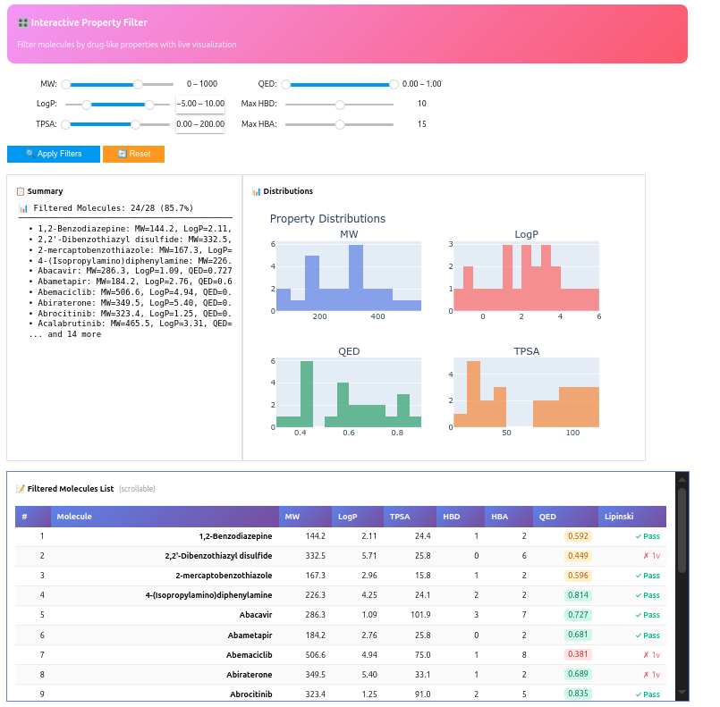

  

<h1 align="center">DrugOptimiser</h1>

  <strong>An Advanced Drug Screening & Quantum Chemistry Platform</strong>

  
  
  
  
  

**From SMILES to Wavefunction: A comprehensive, interactive platform for computational drug screening.**

## 🚀 Overview
**DrugOptimiser** is an advanced computational chemistry tool designed to streamline the drug screening process. It bridges the gap between rapid cheminformatics screening and high-accuracy Quantum Mechanical (DFT) calculations. 

**Key Philosophy:** *Filter fast with ADMET, confirm accurately with DFT.*

### ✨ Key Features
- **interactive Dashboards**: Zero-code interfaces for every step of the pipeline.
- **Advanced ADMET**: Real-time traffic-light indicators for BBB, hERG, Solubility, and Aggregation risks.
- **Parallel DFT Engine**: Multi-threaded, batch geometry optimization with PySCF.
- **Visual Quantum Chemistry**: Interactive 3D Molecular Orbitals, HOMO-LUMO diagrams, and ESP surfaces.

---

## 🖥️ Interactive Dashboards

### 1. 🧬 ADMET Property Filter
Rapidly screen thousands of molecules against medicinal chemistry rules (Lipinski, Veber, Ghose, Muegge). Features real-time distribution plots and instant filtering.

### 2. ✏️ Molecular Editor & Designer
Draw, edit, or import molecules with real-time feedback.
- **Traffic Light Indicators**: Instant green/yellow/red signals for Toxicity and ADMET properties.
- **Similarity Search**: Find analogs in your library instantly.
- **Conformer Explorer**: Visualize 3D conformers on the fly.

### 3. 🚀 Batch DFT Optimization Panel
Harness the power of Quantum Mechanics without writing scripts.
- **Queue Management**: Track Pending, Running, and Completed jobs.
- **Real-time 3D Preview**: Watch your molecule relax geometry live!
- **Settings Card**: Easily configure Functional (B3LYP, PBE0), Basis Set (6-31G*), and Dispersion (D3/D4).

### 4. ⚖️ Molecule Comparison Tool
Side-by-side comparison of any two molecules.
- **Radar Charts**: Compare drug-likeness profiles against an "Ideal Drug" reference.
- **Structural Overlay**: Visualize 3D structural differences.

---

## 🔬 Quantum Chemical Analysis

DrugOptimiser produces publication-quality visualizations automatically.

### 📉 Molecular Orbital Energy Diagrams
Visualize the electronic structure, Frontier Orbitals, and the HOMO-LUMO gap (a key indicator of reactivity).

### ⚛️ Orbital Composition Analysis
Understand exactly which atomic orbitals contribute to the HOMO and LUMO. Identifying the reactive centers of your molecule has never been distinguishable.

### 🌐 3D Orbital Visualization
Interactive 3D HTML exports allow you to rotate and inspect positive/negative phases of wavefunctions.
*(Files generated in `./results/molecular_orbitals/`)*

---

## ✨ Key Features

### 🧪 Molecular Analysis & ADMET
- **50+ Molecular Descriptors**: MW, LogP, TPSA, HBD/HBA, rotatable bonds, and more
- **Drug-Likeness Filters**: Lipinski's Rule of 5, Veber, Ghose, Egan, Muegge, Lead-likeness
- **Structural Alerts**: PAINS, Brenk alerts, REOS filter, aggregator prediction
- **Synthetic Accessibility**: SA Score calculation

### ⚛️ Quantum Chemistry (DFT)
- **Multiple Functionals**: LDA, GGA (PBE, BLYP), Hybrid (B3LYP, PBE0), Meta-GGA, Range-Separated, Double Hybrids
- **Extensive Basis Sets**: From STO-3G to aug-cc-pVQZ
- **Dispersion Corrections**: D3, D3(BJ), D4
- **Solvation Models**: PCM, COSMO, ddCOSMO, SMD
- **ECPs**: For heavy elements (I, Br, etc.)

### 📊 Advanced Analysis
- **Conceptual DFT**: Electronegativity, Hardness, Electrophilicity Index
- **Fukui Functions**: Metabolic site prediction (CYP450 reactivity)
- **ESP Analysis**: H-bond donor/acceptor mapping, σ-hole detection
- **Toxicity Prediction**: DFT-derived ADMET indicators with risk levels

### 🎨 Interactive Visualization
- **3D Molecular Viewer**: py3Dmol integration with multiple styles
- **Trajectory Playback**: Frame-by-frame optimization visualization
- **MO Visualization**: HOMO/LUMO cube file rendering
- **Property Dashboards**: Radar charts, histograms, comparison tools

### ⚡ Performance & Scalability
- **Parallel Batch Processing**: Up to N concurrent DFT jobs
- **Crash Recovery**: Progress tracking with automatic resume
- **Resource Management**: Intelligent CPU/memory allocation

---

## 📖 Documentation

| Document | Description |
|----------|-------------|
| [API Reference](docs/API_Reference.md) | Complete API documentation |
| [Examples](examples/) | Jupyter notebook tutorials |

---

## 🛠️ Technologies Used

  
  
  
  
  

- **[PySCF](https://pyscf.org/)** - Quantum chemistry calculations
- **[RDKit](https://www.rdkit.org/)** - Cheminformatics toolkit
- **[py3Dmol](https://3dmol.org/)** - 3D molecular visualization
- **[IPyWidgets](https://ipywidgets.readthedocs.io/)** - Interactive Jupyter controls
- **[Plotly](https://plotly.com/)** - Interactive charts

---

## 🤝 Contributing

Contributions are welcome! Please see our [Contributing Guide](CONTRIBUTING.md) for details.

1. Fork the repository
2. Create your feature branch (`git checkout -b feature/AmazingFeature`)
3. Commit your changes (`git commit -m 'Add AmazingFeature'`)
4. Push to the branch (`git push origin feature/AmazingFeature`)
5. Open a Pull Request

---

## 📄 License

This project is licensed under the MIT License - see the [LICENSE](LICENSE) file for details.

---

## 👤 Author

**Mayukh** - *Computational Chemistry*

- GitHub: [@mayukh95](https://github.com/mayukh95/)
- Email: kansarimayukh@gmail.com

---

## ⭐ Acknowledgments

- [PySCF Team](https://pyscf.org/) for the excellent quantum chemistry library
- [RDKit Community](https://www.rdkit.org/) for cheminformatics tools
- [Jupyter Project](https://jupyter.org/) for the interactive computing platform

---

